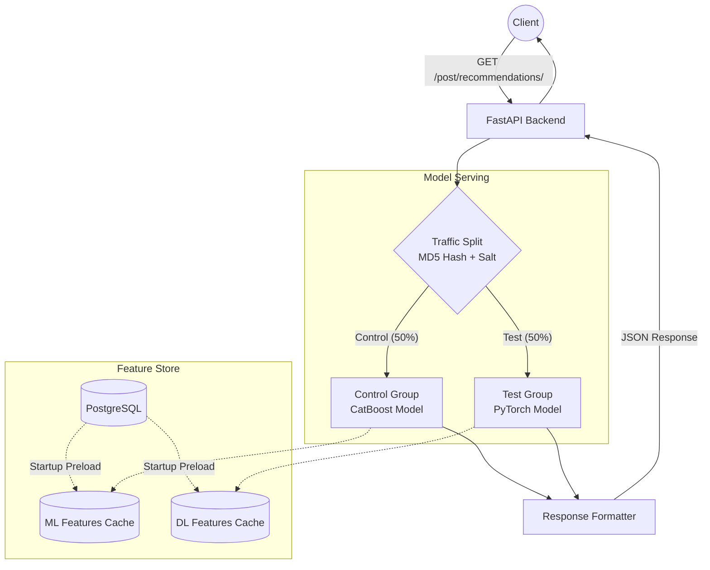
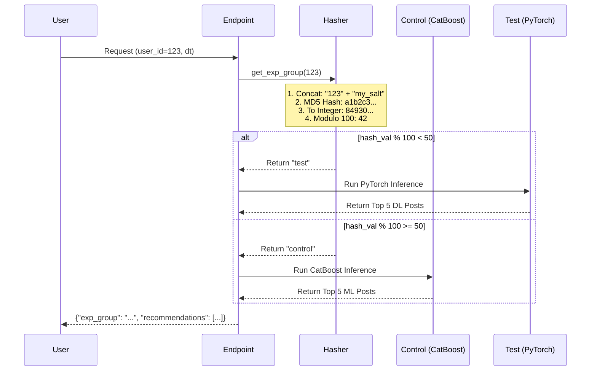

# High-Load A/B Testing Recommendation Service


## Business Context

This project represents a scalable content recommendation engine developed for a high-traffic social media/e-commerce application. The goal of this service is to dynamically serve customized post recommendations to users, aiming to increase user engagement metrics (e.g., likes, retention) and conversion rates. 

To continuously improve recommendation quality, the service implements a robust **A/B testing architecture**. Real-time traffic is deterministically split between a lightweight control model (CatBoost) and a computationally heavier, deep learning-based test model (PyTorch with categorical embeddings).

## System Architecture

The service leverages a FastAPI backend connected to a PostgreSQL Feature Store. 

### Key Architectural Decisions:
1. **In-Memory Caching:** To achieve < 500ms latency per request, post and user features are pre-loaded into Pandas DataFrames during the application startup phase.
2. **Deterministic Hashing:** A/B traffic splitting is handled using `hashlib.md5(user_id + SALT)`. This ensures that a specific user always falls into the same experimental group across multiple sessions, preventing data corruption during the experiment.
3. **Model Fallback:** The API serves CatBoost recommendations as the baseline (Control) and dynamically invokes the PyTorch embedding architecture for the Test group.

### A/B Split & Inference Workflow



## The A/B Splitting Workflow

The core of an A/B test is the splitting mechanism. It must satisfy two strict rules:
1. **Deterministic**: If User #123 is placed in the Test group today, they must remain in the Test group tomorrow. If they switch groups, the experiment data gets corrupted.
2. **Unbiased/Randomized**: The distribution of users must naturally fall to a 50/50 split without skewing based on user ID patterns (e.g., all even IDs shouldn't necessarily go to one group if IDs aren't randomly generated).

### The Hashing Implementation
To achieve this, we use the `hashlib.md5` hashing algorithm combined with a **salt**.



**Why a Salt?**
If multiple teams run multiple A/B tests on the same users, simply using `md5(user_id) % 100` would result in the exact same users falling into the test group for *every single experiment*. By adding a unique `SALT` (like `"my_salt"`), we pseudo-randomize the distribution entirely for this specific experiment.

## Setup & Deployment

This service is fully containerized using Docker, allowing seamless deployment to any cloud environment.

### 1. Model Weights
To prevent bloating the Git repository with large `.pkl` files, the model generation process is simulated.
* **Control Model:** You can run `python generate_models.py` to create a dummy `model_control.pkl` in the root directory. 
* **Test Model:** For demonstration, the PyTorch model weights are serialized as a Base64 string directly within `app.py`. In a true production environment, these would be retrieved from an S3 bucket or local volume.

### 2. Environment Variables
Secure credentials and configurations are loaded via environment variables.

Copy the `.env.example` file:
```bash
cp .env.example .env
```
Update `.env` with your PostgreSQL credentials.

### 3. Docker Deployment
Build and run the FastAPI service via Docker:

```bash
# Build the Docker image
docker build -t recommendation-service .

# Run the container (injecting the .env file)
docker run -d --name rec-api -p 8000:8000 --env-file .env recommendation-service
```

### 4. API Endpoints
* **Swagger UI:** `http://localhost:8000/docs`
* **Recommendation Endpoint:**
  ```http
  GET /post/recommendations/?id=200&time=2023-01-01T12:00:00&limit=5
  ```
  Returns a structured JSON response containing the recommended posts and the assigned experimental group (`control` or `test`).
